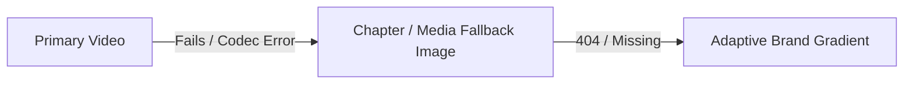

# Media & Background Asset Guidelines

HORIZON supports video backgrounds, static artwork, slideshow sequences, and multi-scene chapter cinematics.

---

## Supported Media Types

Configure `Config.Media.type` in [config.lua](file:///g:/SYNC%20WORKSHOP/development_phase/sync_loading/config.lua):

| Type | Description |
| :--- | :--- |
| `'video'` | Loops a single MP4 or WebM video file in the background. |
| `'image'` | Displays a single high-resolution static WebP, JPG, or PNG image. |
| `'slideshow'` | Crossfades between an array of images configured in `Config.Cinematics.chapters`. |
| `'chapters'` | Sequences through multi-scene chapters (supporting mixed video and images) with custom labels and transitions. |
| `'gradient'` | Lightweight, high-performance CSS radial gradient using your brand's accent colors. |

---

## File Placement

Media assets must be located within the web root:
```text
sync_loading/
└── web/dist/assets/media/
    ├── horizon-boulevard.webp
    ├── server-trailer.webm
    └── chapter-02.webp
```

---

## Specifications & Recommended Encodings

### 1. Video Recommendations
- **Format / Container**: `.webm` (VP9 / VP8) or `.mp4` (H.264).
- **Resolution**: 1920×1080 (1080p). Avoid 4K video files as they cause CEF memory pressure and slow down connection times.
- **Framerate**: 30 FPS.
- **Bitrate**: 2,000 kbps to 3,500 kbps (target file size under 30 MB).
- **Audio**: Remove audio track from video files (`-an`); use `Config.Music` for all audio playback.

#### Recommended FFmpeg Video Encoding Command:
```bash
ffmpeg -i input.mp4 -c:v libvpx-vp9 -b:v 2500k -minrate 1500k -maxrate 3500k -vf scale=1920:1080 -r 30 -an output.webm
```

### 2. Image Recommendations
- **Format**: `.webp` (lossy, quality 80–85).
- **Resolution**: 1920×1080 (up to 2560×1440 for high DPI).
- **Target Size**: Under 500 KB per image.

#### Recommended FFmpeg / WebP Image Command:
```bash
cwebp -q 82 input.png -o output.webp
```

---

## Focal Point Alignment

When images or videos are rendered at different aspect ratios (e.g. 16:9, 16:10, 21:9 ultrawide, or 32:9 super-ultrawide), HORIZON uses `Config.Media.focalPoint` to anchor the media:

- `'center'` (default): Centered horizontally and vertically.
- `'left'`: Anchors image content to the left margin.
- `'right'`: Anchors image content to the right margin.
- `'top'` / `'bottom'`: Anchors vertically.

> [!TIP]
> When using the default **Left Wedge** layout, important visual subjects (characters, vehicles, monuments) should be framed in the center-right of the composition.

---

## Fail-Safe Fallback Hierarchy

To prevent blank or broken screens if an asset fails to load:



1. If a **video** encounters an error or decode failure, HORIZON seamlessly switches to `Config.Media.fallback`.
2. If an **image** is missing or unreachable, HORIZON falls back to a branded CSS gradient.
3. Broken-image or error indicators are never displayed to players.

---

## Performance Modes

Adjust `Config.Performance.mode` in `config.lua`:

- **`'high'`**: Video preloading, smooth Ken Burns zoom animations, full motion blurs and transitions.
- **`'balanced'`**: Standard transition timings, paused background animations when unfocused.
- **`'low'`**: Disables video decoding in favor of static images; disables ambient zoom; optimal for low-end systems.
